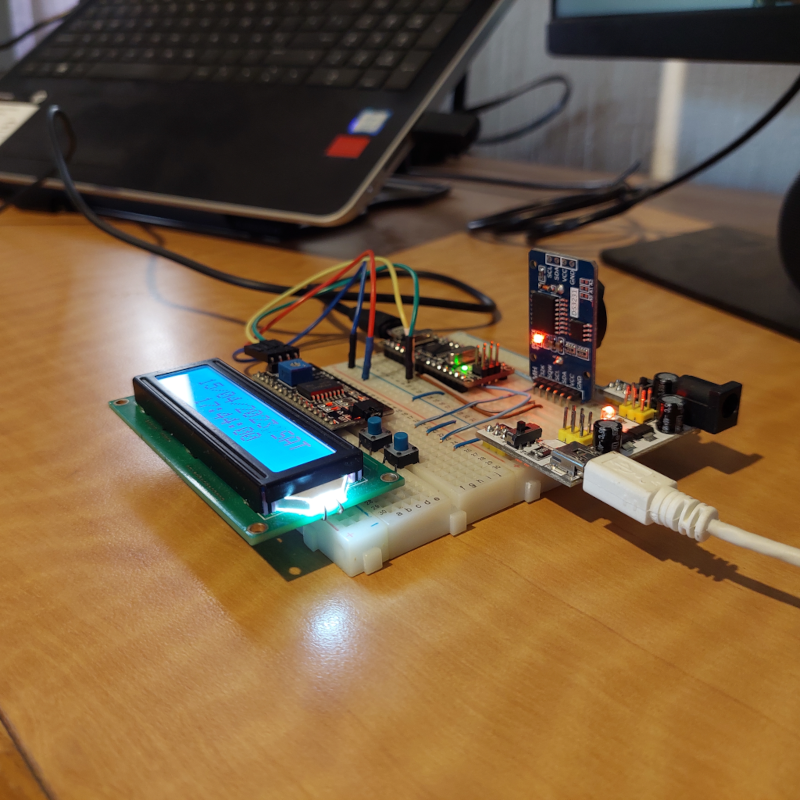
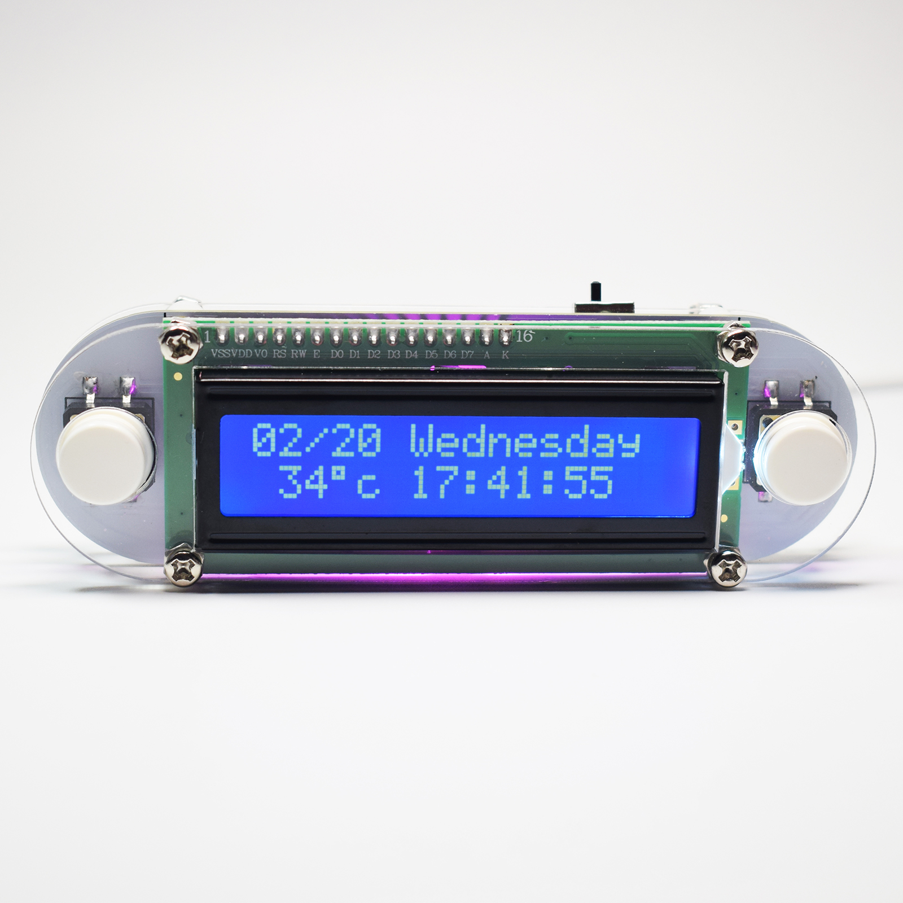

# Clock LCD Arduino

The purpose of this project is to implement the same menus and settings seen in some chinese DIY clock kits but using
the Arduino Nano. Here is a picture of the project:

Chinese clock kit:

The following video shows the different menus and settings the kit has. The goals is to achive a similar level of
functionality with this project.

This project uses the following libraries:
- [LiquidCrystal_I2C v1.1.3](https://github.com/johnrickman/LiquidCrystal_I2C/releases/tag/1.1.3)
- [AbleButton v0.3.0](https://github.com/jsware/able-buttons/releases/tag/0.3.0)
- [DS3231 v1.1.2](https://github.com/NorthernWidget/DS3231/releases/tag/v1.1.2)