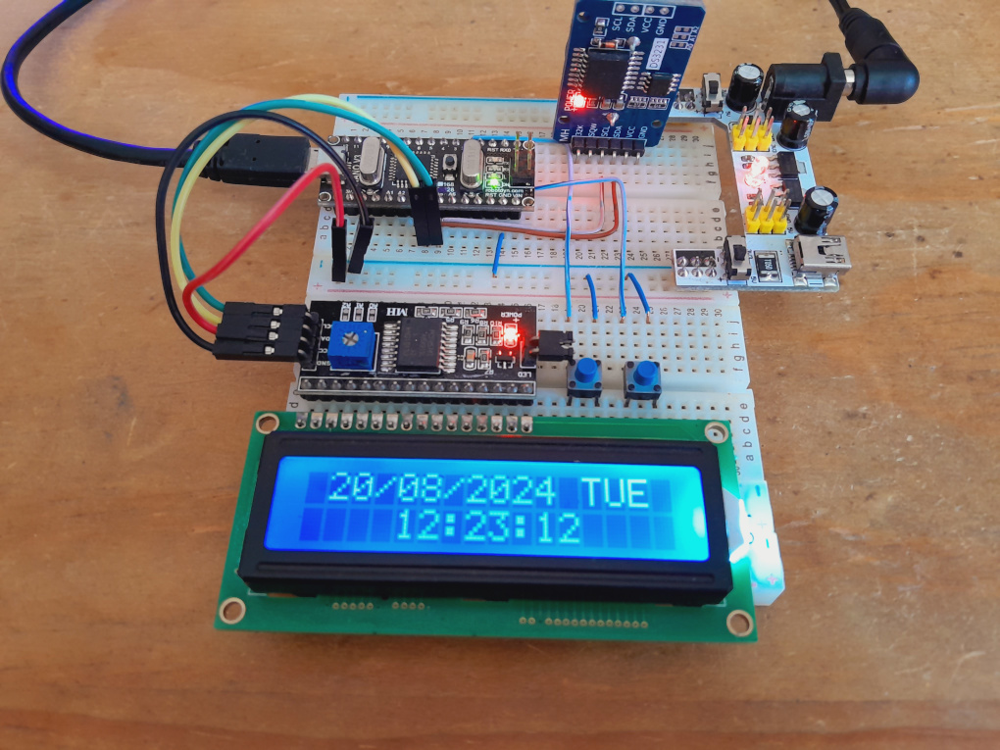

# Clock LCD Arduino

The purpose of this project is to implement a fully functional clock with Arduino. Also this project may help as a base for
similar projects.

Here is the connections' diagram:

And a picture of the prototype:

## Instructions to use the clock

Read the user manual to know how to use the clock: [user-manual](./docs/user-manual.md)

This project uses the following libraries:
- [LiquidCrystal_I2C v1.1.3](https://github.com/johnrickman/LiquidCrystal_I2C/releases/tag/1.1.3)
- [AbleButton v0.3.0](https://github.com/jsware/able-buttons/releases/tag/0.3.0)
- [DS3231 v1.1.2](https://github.com/NorthernWidget/DS3231/releases/tag/v1.1.2)